# Dynamic RBAC Refactor Implementation Plan (High-Risk Refactor)

This document outlines the step-by-step execution and branching strategy for implementing the **Dynamic Role-Based Access Control (RBAC)** subsystem in accordance with [`.scratch/dynamic-rbac/spec.md`](file:///home/bayuajin28/exam-app/.scratch/dynamic-rbac/spec.md) and [ADR 0014](file:///home/bayuajin28/exam-app/docs/adr/0014-dynamic-rbac-system.md).

> [!CAUTION]
> **High-Risk Core Architecture Refactor:**
> This refactor alters the foundational authorization, authentication seams, database tables, and Server Action guards across the entire application.
> 
> **Special Git & Safety Directives:**
> 1. **Do NOT squash commits:** Full commit granularity and git history must be preserved for auditability and precise rollback points.
> 2. **Do NOT merge directly to `dev` per ticket:** All work is isolated in a dedicated integration epic branch (`refactor/dynamic-rbac`).
> 3. **Review & Discussion Checkpoint:** The final merge from `refactor/dynamic-rbac` into `dev` will only happen after all 8 tickets are completed, verified via Fast Gate, and explicitly discussed & approved with the team.

---

## 1. Branching Strategy & Workflow

```mermaid
gitGraph
   commit id: "dev-latest"
   branch refactor/dynamic-rbac
   checkout refactor/dynamic-rbac
   branch refactor/rbac-01-schema
   commit id: "T1: Schema & Seed"
   checkout refactor/dynamic-rbac
   merge refactor/rbac-01-schema id: "Merge T1 (no-squash)"
   branch refactor/rbac-02-engine
   commit id: "T2: Auth Engine"
   checkout refactor/dynamic-rbac
   merge refactor/rbac-02-engine id: "Merge T2 (no-squash)"
   commit id: "T3 to T8..."
   checkout dev
   commit id: "Dev checkpoint"
   merge refactor/dynamic-rbac id: "Final Approved Merge to dev"
```

### Protocol:
1. **Epic Branch Creation:**
   ```bash
   git checkout dev && git pull origin dev
   git checkout -b refactor/dynamic-rbac
   git push -u origin refactor/dynamic-rbac
   ```
2. **Per-Ticket Sub-branches:**
   - Branched from `refactor/dynamic-rbac`: `refactor/rbac-<NN>-<slug>`.
   - Sub-ticket PRs target `refactor/dynamic-rbac` with **Merge Commit (`--merge`)** (NO squash).
3. **Local Fast Gate Gatekeeping:**
   - Every sub-ticket must pass `pnpm run lint && pnpm run typecheck && pnpm run test:unit && pnpm run build`.
4. **Final Gate & Discussion Checkpoint:**
   - Once Ticket 01 through Ticket 08 are merged into `refactor/dynamic-rbac` and 100% green, we conduct a comprehensive review discussion before opening the PR to `dev`.

---

## 2. Ticket Execution Breakdown

```mermaid
gantt
    title Dynamic RBAC Refactor Sequence
    dateFormat X
    axisFormat %d
    section Stage 1: Foundation
    Ticket 01 (Schema & Seed Migration)     :active, t1, 0, 1
    Ticket 02 (Auth Engine & Cached Guards) :t2, after t1, 1d
    section Stage 2: Actions & Invariants
    Ticket 03 (Super Admin Role Actions)    :t3, after t2, 1d
    Ticket 04 (User Multi-Role Assignment)  :t4, after t2, 1d
    Ticket 05 (Domain Actions Authorization):t5, after t2, 1d
    section Stage 3: UI & Routing
    Ticket 06 (Role Management UI & Matrix) :t6, after t3, 1d
    Ticket 07 (Dynamic Nav & Route Guard)   :t7, after t6, 1d
    section Stage 4: Cutover & Gate
    Ticket 08 (Cleanup & Fast Gate)         :t8, after t7, 1d
```



---

### **Stage 1: Foundation Layer**

#### **Ticket 01: Core RBAC Schema, Permissions Catalog & Database Seed Migration**
* **Branch:** `refactor/rbac-01-schema-and-seed` (targeting `refactor/dynamic-rbac`)
* **Deliverables:**
  1. Define Drizzle tables in `lib/db/schema.ts`:
     - `roles`: `id`, `name`, `slug`, `description`, `isSystem`, `isDefault`, `createdAt`, `updatedAt`
     - `permissions`: `id`, `resource`, `action`, `name`, `description`, `module`, `createdAt`
     - `rolePermissions`: `roleId`, `permissionId` (Composite PK)
     - `userRoles`: `userId`, `roleId` (Composite PK)
  2. Create static permission catalog in `lib/auth/permissions-catalog.ts` exporting constants for 11 resources:
     - `users`, `user_groups`, `roles`, `question_banks`, `question_categories`, `exams`, `exam_schedules`, `grading`, `results`, `reports`, `system`.
  3. Create seed script `lib/db/seed-rbac.ts` for default permissions and 3 baseline roles:
     - `super-admin` (`isSystem: true`)
     - `admin` (`isSystem: false` with standard management permissions)
     - `user` (`isSystem: true`, `isDefault: true`)
  4. Create migration helper to copy legacy `user.role` entries into `user_roles`.
  5. Unit tests: `__test__/unit/rbac-schema-and-seed.test.ts`.

---

#### **Ticket 02: Authorization Engine, Cached Permission Resolver & Privilege Guards**
* **Branch:** `refactor/rbac-02-auth-engine-and-guards` (targeting `refactor/dynamic-rbac`)
* **Deliverables:**
  1. Implement `getUserEffectivePermissions(userId)` in `lib/auth/rbac-queries.ts` with `"use cache"` and `cacheTag(\`permissions:user:${userId}\`)`.
  2. Implement `hasPermission(userId, permission)` supporting wildcard bypass for `super-admin`.
  3. Implement `requirePermission(permission)` helper in `lib/auth/rbac-guards.ts` throwing `ForbiddenError`.
  4. Implement cache invalidation functions in `lib/auth/rbac-cache.ts`: `revalidateUserPermissions(userId)` and `revalidateRolePermissions(roleId)`.
  5. Unit tests: `__test__/unit/rbac-engine-guards.test.ts`.

---

### **Stage 2: Core Actions & Invariant Enforcement**

#### **Ticket 03: Super Admin Role Management Server Actions & Invariant Validation**
* **Branch:** `refactor/rbac-03-role-actions` (targeting `refactor/dynamic-rbac`)
* **Deliverables:**
  1. Implement Server Actions in `lib/auth/role-actions.ts`:
     - `listRoles()`: returns roles, system status, user counts, and permission lists.
     - `createRole({ name, description, permissionIds })`: guarded for Super Admin.
     - `updateRole(roleId, { name, description, permissionIds })`: prevents altering system role metadata.
     - `deleteRole(roleId)`: rejects system roles & blocks deletion if active users are attached (`userRolesCount > 0`).
  2. Cache tag invalidation: triggers `revalidateTag("roles")` and affected user permission tags.
  3. Unit tests: `__test__/unit/role-actions.test.ts`.

---

#### **Ticket 04: User-to-Roles Assignment Actions & Bulk Import Support**
* **Branch:** `refactor/rbac-04-user-role-assignment` (targeting `refactor/dynamic-rbac`)
* **Deliverables:**
  1. Implement `assignUserRoles(targetUserId, roleIds)` in `lib/users/role-assignment-actions.ts` guarded by `roles:assign`.
  2. Enforce privilege escalation invariant: non-super-admins cannot assign or remove `super-admin`.
  3. Update `createUser` in `lib/users/create.ts` to support multi-role assignment.
  4. Update Excel bulk participant import in `lib/participants/import-actions.ts` to assign default `user` system role.
  5. Unit tests: `__test__/unit/user-role-assignment.test.ts`.

---

#### **Ticket 05: Domain Server Actions Authorization Migration**
* **Branch:** `refactor/rbac-05-domain-actions-migration` (targeting `refactor/dynamic-rbac`)
* **Deliverables:**
  1. Update Question Banks & Categories actions to enforce `question_banks:*` and `question_categories:*`.
  2. Update Exams & Exam Questions actions to enforce `exams:*` and `exams:questions_manage`.
  3. Update Exam Schedules & Eligibility actions to enforce `exam_schedules:*` and `eligibility:manage`.
  4. Update User Management & Ban actions to enforce `users:*` and `user_groups:*`.
  5. Update Manual Grading actions to enforce `grading:*`.
  6. Update System Settings actions to enforce `system_settings:*`.
  7. Unit tests: Update existing action test suites to pass with dynamic permission mocks.

---

### **Stage 3: User Interface & Navigation**

#### **Ticket 06: Role Management UI & Module Permission Matrix**
* **Branch:** `refactor/rbac-06-role-ui` (targeting `refactor/dynamic-rbac`)
* **Deliverables:**
  1. Create `/dashboard/roles` listing page with responsive table, role badges, user count indicators, and action triggers.
  2. Create Role Form modal/page with permission matrix checkbox grid grouped by domain module with "Select All in Module" toggles.
  3. Create Delete Role confirmation modal with clear usage warnings.
  4. Update User Edit form (`/dashboard/users/[userId]/edit`) and Create form with multi-role badges and checkboxes.
  5. Unit tests: `__test__/unit/role-management-ui.test.tsx`.

---

#### **Ticket 07: Dynamic Dashboard Navigation & Route Access Guard**
* **Branch:** `refactor/rbac-07-dynamic-navigation` (targeting `refactor/dynamic-rbac`)
* **Deliverables:**
  1. Update `app/(dashboard)/layout.tsx` and `components/dashboard-components/app-sidebar.tsx` to filter menu links based on `hasPermission(userId, requiredPermission)`.
  2. Update `lib/auth/permissions.ts` route matcher to validate URL paths against user permissions.
  3. Ensure seamless redirect to `/dashboard/forbidden` or `/dashboard` on unauthorized route visits.
  4. Unit tests: `__test__/unit/dynamic-navigation.test.tsx` and `__test__/unit/route-permissions.test.ts`.

---

### **Stage 4: Polish & Final Cutover**

#### **Ticket 08: Schema Cleanup, Legacy Enum Drop & Fast Gate Verification**
* **Branch:** `refactor/rbac-08-cleanup-and-fast-gate` (targeting `refactor/dynamic-rbac`)
* **Deliverables:**
  1. Remove legacy `user.role` column and drop `app_role` enum in Drizzle schema.
  2. Remove deprecated helpers from `lib/auth-roles.ts`.
  3. Run full Fast Gate: `pnpm run lint && pnpm run typecheck && pnpm run test:unit && pnpm run build`.
  4. Verify production build PPR markers (`◐`) and complete test suite success.

---

## 3. Final Cutover & Merge Discussion Protocol

1. **Pre-Merge Audit:** Once Ticket 08 is merged into `refactor/dynamic-rbac`, a comprehensive test matrix and git diff audit will be generated.
2. **Review Discussion:** We will discuss and walk through the changes together before opening the PR from `refactor/dynamic-rbac` into `dev`.
3. **Preserved History:** The merge into `dev` will be performed via **Merge Commit** (NOT squash) to preserve the entire commit history and granular audit logs.
